1. Mengganti konten lib/main.dart dengan kode berikut.
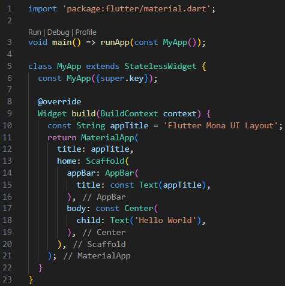

2. Menambahkan TitleSection widget.
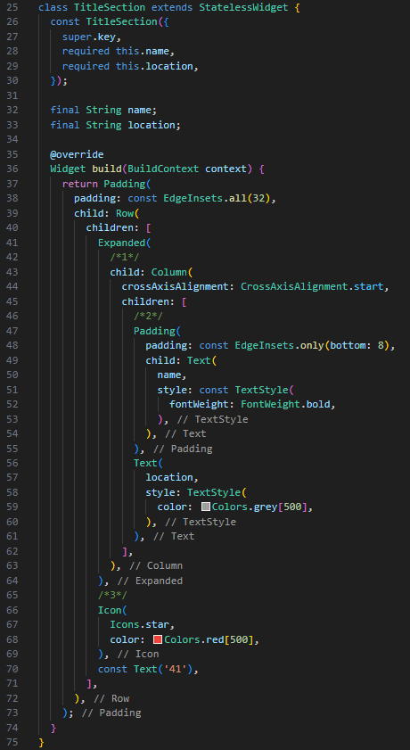

3. Mengganti Centerwidget dengan SingleChildScrollViewwidget. Di dalam SingleChildScrollViewwidget, ganti Textwidget dengan Columnwidget.
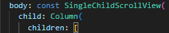

4. Menambahkan TitleSection widget sebagai elemen pertama dalam children daftar.
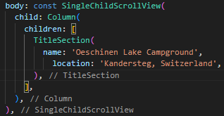

5. Menambahkan kode berikut ke dalam ButtonSectionwidget.
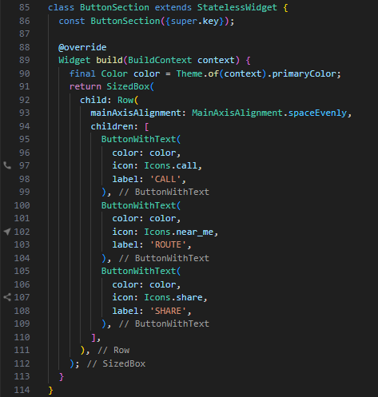
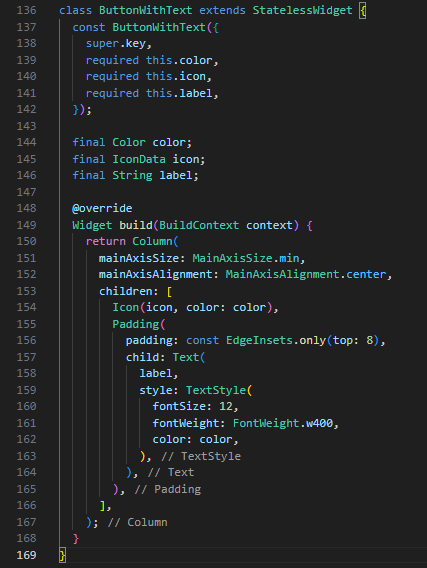

6. Menampilkan bagian tombol, Menambahkan bagian tombol ke children daftar.
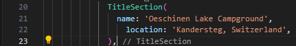

7. Menambahkan TextSection Widget, dan Menambahkan kode berikut.
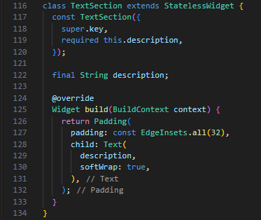

8. Menambahkan widget baru TextSection sebagai anak setelah ButtonSection.
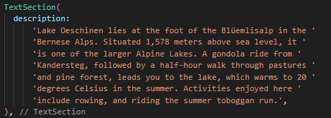

9. Membuat images direktori.
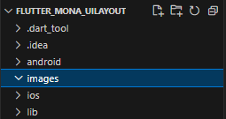

10. Download gambar dan tambahkan ke images direktori baru.
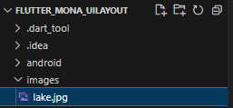

11. Menambahkan assets tag ke pubspec.yaml file di direktori akar aplikasi kita.

12. Membuat ImageSection Widget.
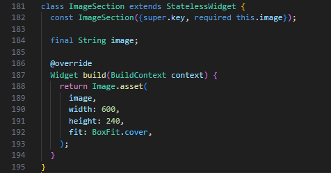

13. Menambahkan ImageSection Widget sebagai anak pertama dalam children daftar.
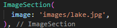

14. Saat kita melakukan hot reload aplikasi, tampilan aplikasi kita akan menjadi seperti berikut ini.
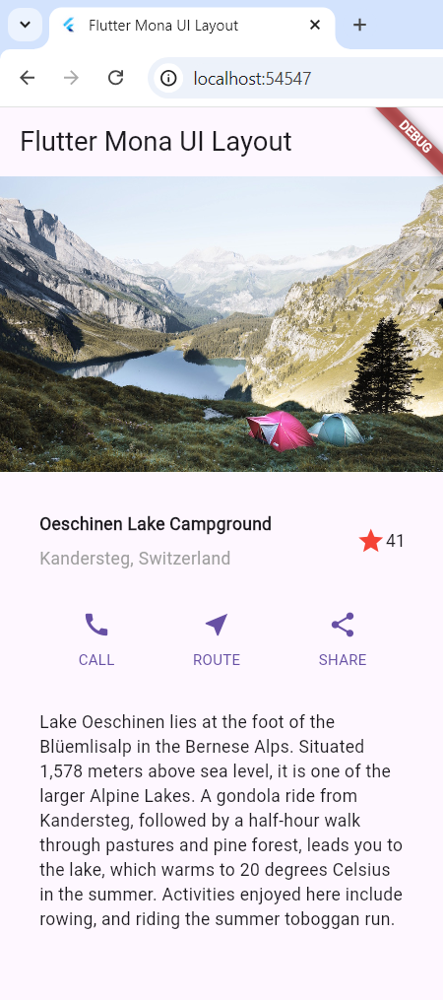